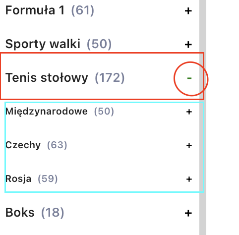
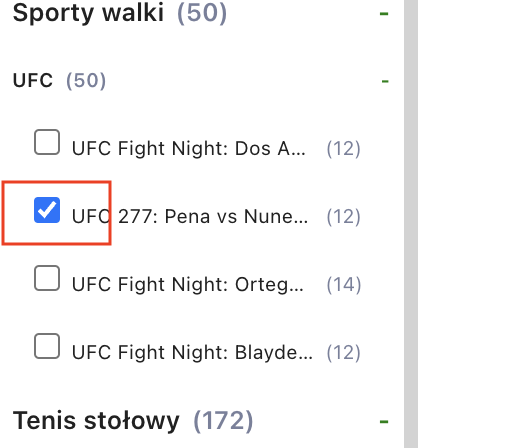

# Zadanie rekrutacyjne
---
## Ogólne
Rozwiązane zadanie z harmonijka można znaleźć [tutaj](https://sbsoftware-task.herokuapp.com/).
Repozytorium można znaleźć [tutaj](https://github.com/miloszmisiek/sbsoftware-react-task).

W zadaniu został podany link, który zwracał Endpoint w postaci obiektu JSON.
Pierwszy problem do rozwiązania polegał na obejściu CORS (Cross-Origin Resource Sharing) , który uniemożliwiał zebrania danych z linku.
Rozwiązanie:
- użyty został serwer PROXY https://cors-anywhere.herokuapp.com/
- aby dane mogły zostać poprawnie zebrane należy przejść do strony [cors-anywhere](https://cors-anywhere.herokuapp.com/corsdemo) a następnie kliknąć przycisk `Request temporary access to the demo server`
- jeżeli harmonijka miałaby zostać użyta w trybie produkcyjnym, lepszym rozwiązaniem byłoby stworzyć własny serwer PROXY w celu rozwiązania problemu

## Zarzadzanie stanem przez Redux Toolkit
Do stworzenia aplikacji został użyty React.js z wykorzystaniem [Redux Toolkit](https://redux-toolkit.js.org/) do zarzadzania stanu - z dokumentacji można wyczytać ze jest to preferencyjna metoda wykorzystywana do tworzenia projektów.

## Harmonijka 'klon' forBET
Harmonijka dostarczona w tym projekcie jest próba stworzenia kopii menu ze strony [forBET](https://www.iforbet.pl/).
Efekty końcowe:
1. **Sukcesy:**
   - Wszystkie dane są przetworzone z API Endpoint.
   - Harmonijka zawiera 3 zagnieżdżone poziomy zgodnie z zakresem "level" obiektu JSON
   - Główne zakładki to obiekty, których klucz "parentCategory" jest wartości 0
   - Każdy kolejny poziom jest w relacji do poziomu zakładki rodzica z jego "categoryId"
   - Obiekt JSON został przesortowany według klucza "sortOrder"
   - Przy każdym tytule zakładki jest dołączona informacja z klucza "eventsCount"
   - Kategorie Esportowe zostały wyselekcjonowane i zgrupowane w oddzielna kategorie 'Esport' na końcu harmonijki zgodnie z wytycznymi z zdania.
2. **Bugi/błędy:**
   - Zakładka nie zamyka się, jeżeli zostanie otwarta kolejna - błąd został zauważony przy końcowym etapie budowania harmonijki, w obecnej postaci i z obecnym doświadczaniem wydaje się to być skomplikowanym procesem, należałoby przebudować konstrukcje aby uwzględnić tą funkcje.
   - Zmiana koloru przy kliknięciu zakładki z poziomu 2 i 3 - j/w
   - Ikonki przy kategoriach - w treści zadania jest notatka *"Pod ocenę nie jest brany design"* w związku z tym ikonki nie zostały użyte w zadaniu.

## Responsywność
Zbyt mało elementów na stronie by można ocenić jak efektywnie wykorzystać responsywność do urządzeń mobilnych - pominięte w zadaniu.

## Instrukcja działania
1. Kliknij w komponent, aby wyświetlić jego następny poziom:
   
   

2. W poziomie trzecim są widoczne pola checkbox które można zaznaczyć kliknięciem na pole lub tekst.

    
